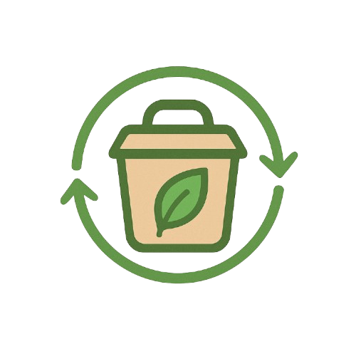

# 🌱 EcoBocado
--- 
## Seguro para ti, seguro para el planeta

---

## Una Nueva Forma de Disfrutar tu Comida Favorita

**EcoBocado** utiliza la aplicación de comida para llevar que revoluciona la manera en que pedimos nuestras comidas favoritas. No somos la típica aplicación de delivery sino un movimiento comprometido con el **Zero Waste** y la alimentación consciente.

---

## 🌍 Nuestro Compromiso Zero Waste

En EcoBocado creemos que disfrutar de comida deliciosa no tiene por qué generar desperdicio. Trabajamos exclusivamente con restaurantes comprometidos con la **reducción de residuos** y el aprovechamiento responsable de alimentos.

### ¿Cómo lo hacemos?

- **Menús**: Platos preparados con ingredientes perfectos que de otro modo se desperdiciarían
- **Sin envases de un solo uso**: Todos nuestros restaurantes partner utilizan packaging sostenible y reutilizable
- **Porciones justas**: Evitamos el desperdicio ajustando las cantidades a lo que realmente necesitas
- **Transparencia total**: Conoce el impacto ambiental de cada pedido

---

## 🥗 Filtros Inteligentes para Todos

Sabemos que cada persona tiene necesidades alimentarias diferentes. Por eso, hemos desarrollado el **sistema de filtros más completo** del mercado.

### Filtro de Alérgenos

¿Eres alérgico o intolerante a algún alimento? Navega con total tranquilidad:

- **Identificación clara**: Cada producto muestra sus alérgenos de forma visual
  - ✓ **Rojo**: El producto **contiene** el alérgeno
  - ~ **Naranja**: El producto **puede contener trazas** del alérgeno
- **14 alérgenos principales**: Gluten, lácteos, huevos, pescado, mariscos, frutos secos, cacahuetes, soja, sésamo, apio, mostaza, sulfitos, altramuces y moluscos
- **Filtrado automático**: Marca tus alérgenos y solo verás productos seguros para ti
- **Información transparente**: Cada plato detalla exactamente qué contiene

### Opciones Veganas

Para quienes eligen una alimentación 100% vegetal:

- **Filtro vegano**: Actívalo y descubre solo opciones completamente plant-based
- **Certificación clara**: Identificación visual de cada producto vegano
- **Variedad garantizada**: Desde entrantes hasta postres, todo pensado para ti

---

## 📱 Experiencia de Usuario Sin Complicaciones

### Catálogo Unificado

Explora todo en un solo lugar:

- **Productos individuales**: Elige tus platos favoritos uno por uno
- **Menús completos**: Ahorra con nuestras combinaciones especiales
- **Búsqueda por categorías**: Entrantes, principales, bebidas, postres...
- **Scroll infinito**: Descubre opciones sin límites

### Información Detallada

Cada producto incluye:

- **Descripción completa**: Ingredientes, preparación y origen
- **Precio transparente**: Sin sorpresas en el checkout
- **Fotos reales**: Ve exactamente lo que vas a recibir
- **Información nutricional**: Alérgenos, opciones veganas y más
- **Composición de menús**: Conoce todos los elementos de tu menú de rescate

---

## 🎯 Características Destacadas

### Para Ti

✨ **Personalización Total**: Configura tus preferencias y alérgenos una sola vez

🔒 **Seguridad Alimentaria**: Información clara y verificada de cada ingrediente

🚀 **Pedidos Rápidos**: Interfaz intuitiva y proceso de compra ágil

📍 **Múltiples Ubicaciones**: Recoge tus pedidos donde más te convenga

### Para el Planeta

🌱 **Reducción de Desperdicios**: Cada pedido contribuye al Zero Waste

♻️ **Economía Circular**: Apoyamos prácticas sostenibles en restauración

🌍 **Huella de Carbono Reducida**: Logística optimizada y envases eco-friendly

---

## 🎁 Programa de Fidelización

Gana puntos con cada pedido y canjéalos por:

- Descuentos en tus próximas compras
- Productos exclusivos
- Acceso anticipado a nuevos menús
- Experiencias especiales con nuestros restaurantes partner

---

## 👥 Gestión de Perfil

- **Múltiples direcciones**: Guarda tus ubicaciones favoritas
- **Métodos de pago**: Gestiona tus tarjetas de forma segura
- **Historial de pedidos**: Repite tus favoritos con un click
- **Preferencias guardadas**: Tus filtros y alérgenos siempre configurados

---

## 🌟 Únete al Cambio

No somos solo una app de comida para llevar. Es una **comunidad de personas conscientes** que eligen disfrutar de comida deliciosa mientras cuidan del planeta.

### Cada Pedido Cuenta

- **Reduces el desperdicio alimentario**: Aprovechas ingredientes de calidad que de otro modo se perderían
- **Apoyas restaurantes responsables**: Impulsas negocios comprometidos con la sostenibilidad
- **Cuidas tu salud**: Filtros personalizados para tus necesidades alimentarias
- **Inspiras a otros**: Tu elección genera un efecto dominó positivo

---

## 📲 Descarga EcoBocado

Disponible para iOS y Android

**Comienza tu viaje hacia una alimentación más consciente y deliciosa hoy mismo.**

---

## 💬 ¿Tienes Preguntas?

Estamos aquí para ayudarte. Contáctanos y descubre cómo EcoBocado puede transformar tu experiencia con la comida para llevar.

---

**EcoBocado** - *Seguro para ti, seguro para el planeta.* 🌱

*Porque cada elección cuenta. Porque el cambio empieza en tu plato.*

